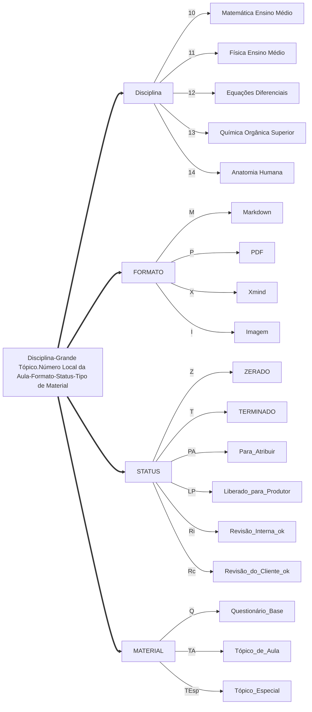
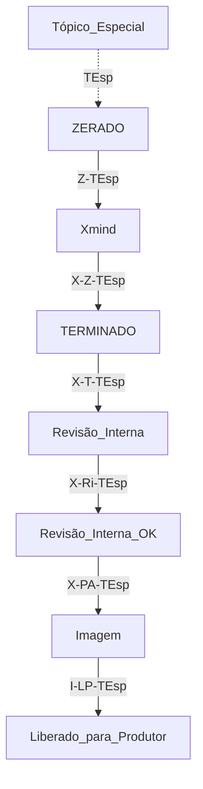
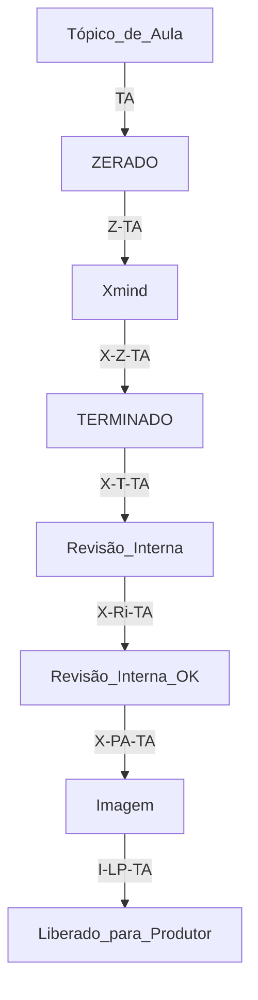
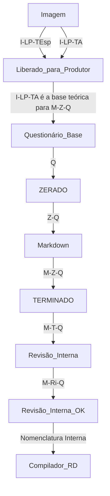
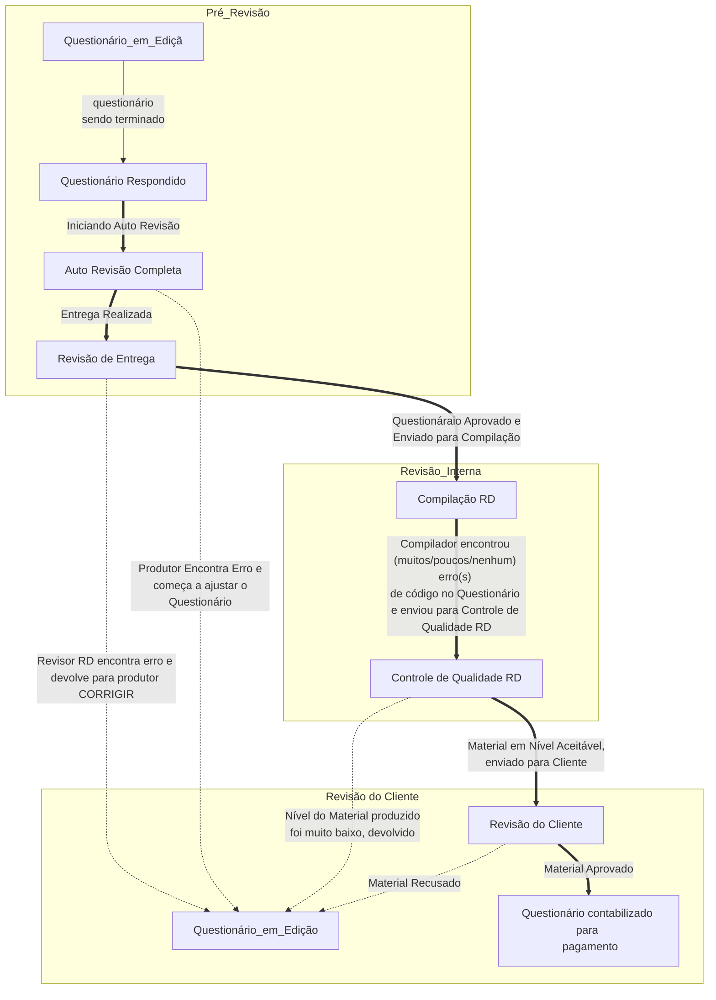

---

# A Empresa
---
## Boas Vindas!
---
Se você está lendo isso, é um produtor de conteúdo da RDResoluções! 
Esse documento é um manual com informações essenciais sobre seu trabalho conosco. Vamos nos apresentar!

---
## Quem Somos
---
A nossa administração é composta de universitários das áreas da engenharia e computação, de doutorandos a bacharéis, oriundos da USP e UFsCar.

---

## Localização
---
Nossa sede fica na cidade de São Carlos, estado de São Paulo. A cidade tem o Campus da USP, com cursos de Engenharia, Ciências Exatas e Arquitetura, e o campus da UFsCar, tanto com cursos de exatas quanto de biológicas e humanas.

---
## O Trabalho
---
A RDResoluções produz material didático para cursos EAD e plataformas educacionais online.  

Atualmente produzimos conteúdo como listas teóricas, vídeo aulas, soluções de questões de livros universitários, além de prestarmos serviço de monitoria online para usuários Premium de plataformas clientes. 

---
### Clientes
---
Alguns dos nossos clientes mais conhecidos:

***Internacionais:***
1. [Chegg](https://www.chegg.com/study); - EUA
2. [Educatina](https://www.educatina.com/); - Argentina
3. [Edu Rev](https://edurev.in/); - Índia

***Nacionais:***

4. [Passei Direto](https://www.passeidireto.com/);
5. [Delinea](http://www.delinea.com.br/)(Não é a marca de Manteiga! =P);
6. [DTCom](https://dtcom.com.br/);
7. [Grupo Kroton](http://www.kroton.com.br/);
8. [FabriCO](http://cursos.fabrico.com.br/);
---
### Cargos na RDResoluções ==*Em Construção*==
---
Todo cargo dentro da RD fornece **um certificado de número de horas em que tal competência foi desenvolvida dentro da empresa**. Na prática, trabalhar na RDResoluções é um grande *curso comissionado* que capacita o universitário para o universo corporativo, ensinando-o a trabalhar com prazos, desenvolver estratégias para solucionar problemas e também a lidar com pessoas de todos os tipos.

---
#### Administração
##### **Coordenador de Equipe** 
---
*Atribuições*
* Responsável por gerenciar um grupo de desenvolvedores ou produtores;
* Tira dúvidas sobre o trabalho e ferramentas necessárias para o trabalho;
* Capacita candidatos aprovados, para o trabalho proposto;
* Controla e estipula prazos de entrega individuais para cada produtor/desenvolvedor;

*Pagamento:* Comissionado
*Contratação:* Freelancer Home-Office
*Requisitos:*
* Vontade de Aprender;
* Trabalhar bem sob pressão;
* Lidar bem com Pessoas;
* Competente em Cumprir Prazos;

*Habilidades Desenvolvidas:*
* Gerência de Projetos;
* Liderança;
* Gestão de Recursos Humanos;
---
##### Programador ==*Em Construção*==
---
##### Auxiliar Administrativo ==*Em Construção*==
---
#### Marketing e Publicidade
##### Agente Comercial ==*Em Construção*==
---
##### Divulgador Digital ==*Em Construção*==
---
##### Web Designer ==*Em Construção*==
---
#### Produção de Conteúdo
##### Mestre Educacional
*Atribuições*
* Responsável por confeccionar o Tópico de Aula, a partir de um Plano de Aula Mestre;
* Tria a bibliografia Oficial para que todo o conteúdo de uma Aula esteja listado e ordenado (*no tópico de Aula*) para utilização pelo Produtor de Conteúdo RD;
* Confecciona ou lista exercícios a serem resolvidos pelo Produtor e incluídos no Questionário Base;
* Gera, se necessário, Tópicos Especiais de Assuntos que não foram inclusos entre duas Aulas, ou que sejam muito extensos e específicos para serem colocados dentro de um Tópico de Aula;

*Pagamento:* Comissionado

*Contratação:* Freelancer Home-Office

*Requisitos:*
* Perícia Máxima da Disciplina com a qual deseja trabalhar;
* Competente em Cumprir Prazos;
* Habilidade com as principais Plataformas utilizadas no trabalho **(Xmind Zen)**

*Habilidades Desenvolvidas:*
* Confecção de Materiais Didáticos Online;
* Planejamento de Aula;
* Horas de aperfeiçoamento em uma disciplina específica;
* *Workflow Management;*
---
##### Produtor de Conteúdo RD

*Atribuições*
* Responsável por responder o Questionário Base de um Tópico de Aula;
* Produz conteúdos, imagens, gráficos, diagramas, artigos e cálculos;
* Realiza correções/adições no questionário, se requisitado;
* Resolve os exercícios propostos pelo Mestre Educacional e inclui tais exercícios (e suas respectivas resoluções) dentro do Questionário Base;

*Pagamento:* Comissionado

*Contratação:* Freelancer Home-Office

*Requisitos:*
* Vontade de Aprender;
* Competente em Cumprir Prazos;
* Linguagem Markdown Nível Intermediário;
* Linguagem LaTeX Nível Iniciante;
* Habilidade com as principais Plataformas utilizadas no trabalho **(StackEdit, Google Drive, Soundcloud)**
* Domínio da Disciplina com a qual deseja trabalhar;

*Habilidades Desenvolvidas:*
* Linguagem Markdown;
* Linguagem LaTeX;
* Confecção de Materiais Didáticos Online;
* Planejamento de Aula;
* Design Gráfico;
* Web Design Básico (HTML);
* Horas de aperfeiçoamento em uma disciplina específica;
---
##### Desenvolvedor de Resoluções ==*Em Construção*==
---

---
### O Público-Alvo
---
O Público-Alvo dos materiais produzidos pela RDResoluções são majoritariamente universitários, tanto de universidades públicas quanto privadas.

Mesmo Conteúdos de Ensino Médio que produzimos visa funcionar como uma revisão de conteúdo, não um “substituto” de um curso tradicional.

---
### Aplicativos úteis para o Trabalho

Para um ritmo de trabalho satisfatório, tenha instalados em seu computador:

* **Ocam** 
App gratuito de gravação de vídeo;

* **[Mathtype](https://drive.google.com/open?id=1IVFmmJp0OUkpSW4uDDZezQ5gcNPlmrkW)** 
App para escrita de expressões matemáticas, de física e de equações químicas. Todos os cálculos devem *preferencialmente* ser feitos nessa ferramenta;

* **Geogebra** 
App gratuito para construção de gráficos;

* **Lighshot** 
Aplicativo de printscreens personalizados. Ele é muito utilizado para captura de imagens ou trechos específicos da sua tela, incluindo imagens da Internet;

* **Xmind ZEN** 
Aplicativo para montagem de Mapas Mentais (Difere totalmente de diagramas!!);

* **ChemSketch** 
Aplicativo para montagem de conteúdo relacionado com a química;

Boa parte do trabalho é realizado via plataformas online gratuitas, porém é bom ter esses programas instalados para alguns dos trechos de resposta. 

Não se preocupe, avisaremos onde e quando baixá-los!

---
# Os Materiais
---
## Resoluções Online
---
Montado pelo **Desenvolvedor de Resoluções**, pode ser feito em word ou direto na plataforma de um cliente. Normalmente é preciso ter conhecimentos de LaTeX ou uso do programa Mathtype, além de outras plataformas.

---
### Formatação
* Deve conter pelo menos 7 linhas de texto;
* Todo caractere de texto deve ser escrito **fora** do ambiente LaTeX;
* Todo caractere matemático deve ser escrito **dentro** do ambiente LaTeX;
* Imagens devem ser de alta qualidade;
* A formatação da resposta é idêntica à soluções SBS;
---
## Plano de Aula
---
O Plano de Aulas consiste em uma planilha base para a divisão dos temas dentro de uma disciplina. O plano é composto por:

* **Grande Tópico:** Uma frente da Disciplina que engloba diversas aulas;

* **Descrição Grande Tópico:** Citação Rápida dos principais pontos que serão aprendidos nesta seção;

* **Tema da Aula:** O título da Aula Propriamente dito;

* **Descrição Tema da Aula:** Citação rápida dos principais pontos que serão aprendidos na Aula em si;

* **Tópicos de Aula:** São **conteúdos obrigatórios dentro do questionário base**;

Tanto o *Plano de Aulas* quanto a *Checklist do Padrão* são utilizados na revisão do questionário base.

**[Plano de Aula recebido pelo ME]**

---
## Tópico de Aula
### Quem Monta
Material Montado pelo *Mestre Educacional*.
### O que É
Consiste em um mapa mental feito no Xmind Zen, que servirá de direcionamento para a resolução do Questionário Base. É baseado em um plano de Aula Mestre. Para mais informações, consulte *Tópico de Aula 101: Um Guia*.

**[ME inicia montagem do Tópico de Aula]**

---
## Tópico Especial
Material Montado pelo *Mestre Educacional*, consiste na construção de um mapa mental dentro do programa Xmind Zen. 

O tópico especial é baseado em pontos não cobertos entre duas aulas, ou casos muito específicos ou extensos para serem abordados dentro de um tópico de Aula. Alguns exemplos clássicos desse tipo seriam *casos de triângulo russo*, na matemática; doenças que afetam o sistemas digestório e se refletem em outros sistemas, na anatomia; mecanismos de reação de duplicação de células de câncer, na química orgânica; e assim por diante.

---
## A Checklist do Padrão
---
A Checklist do Padrão, como o nome diz, é uma lista de verificação utilizada pela RD para garantir que todo o material produzido, independente do produtor, obedeça a mesma estrutura pedida pelo cliente e que contenha o todo o conteúdo que foi exigido. 

Ela fica no *final de todo questionário base* e precisa ser assinalada para que o questionário base seja aceito para **a revisão.**

---
## Questionário Base
### Quem Monta
Montado pelo Produtor RD, a partir do **Tópico de Aula**. 
***Tópico de Aula como o Produtor Receberá***

### O que É
Consiste em um documento escrito em linguagem markdown, que servirá de base de conteúdo para a compilação de outros tipos de materiais. 

Ele contém um conjunto de perguntas guia para a montagem e fornecimento do conteúdo teórico necessário para o aprendizado das informações presentes no Tópico de Aula.

---
### Tipos de Resposta
O questionário base contém diversos tipos de respostas. Cada pergunta tem seu próprio tipo de resposta obrigatória, porém há tipos opcionais que aumentam a nota do material. Veja a seguir.

---
#### Texto:
* ==Resposta(Texto)=={conteúdo}
* Resposta deve consistir apenas por texto;
* Nenhum tipo de imagens ou gráficos são permitidos nesse tipo de resposta;
#### Título:
* ==Resposta(Título)=={conteúdo}
* Resposta para o texto escrito em "Um Pouco de História"
#### Fonte:
* ==Resposta(Fonte)=={conteúdo}
* Referência do texto escrito em "Um Pouco de História"
#### Referência:
* ==Resposta(Referências)=={conteúdo}
* A cópia dos nomes dos arquivos utilizados pelo Mestre Educacional para a montagem dos Tópicos de Aula;
#### Template:
* ==Resposta(Template){cartao_n}{numero_da_template}=={conteúdo}
* Resposta que fornece a numeração do cartão e o tipo de template que será usada na compilação do flashcard;
* Essa resposta sempre vem antes da resposta do flashcard;
#### Flashcard Interativo:
* ==Resposta(Flashcard Interativo)=={conteúdo}
[Exemplo Online](https://quizlet.com/217998734/biologia-organelas-de-uma-celula-animal-diagram/). É dividido em Áudio/Flashcard/Transcrição:
* **Flashcard:** O Flashcard em si, montado através de um conjunto de templates escolhidas por você. A montagem em si é feita pelo nosso algoritmo, porém é preciso que uma tabela seja preenchida com o conteúdo que será colocado no flashcard.
* **Transcrição:** O trecho em texto do que será dito enquanto o flashcard é explicado. Todo tipo de cálculo precisa ser vocalizado, assim como explicações de gráficos e afins.
* **Áudio**
	* *O que é:* A leitura gravada do texto montado anteriormente. Visa transmitir o tom esperado ao se contar tal história para um aluno
	*  *Exemplos:*
<iframe width="100%" height="166" scrolling="no" frameborder="no" allow="autoplay" src="https://w.soundcloud.com/player/?url=https%3A//api.soundcloud.com/tracks/456260502%3Fsecret_token%3Ds-VuaPT&color=%23ff5500&auto_play=false&hide_related=false&show_comments=true&show_user=true&show_reposts=false&show_teaser=true"></iframe>
<iframe width="100%" height="166" scrolling="no" frameborder="no" allow="autoplay" src="https://w.soundcloud.com/player/?url=https%3A//api.soundcloud.com/tracks/456260211%3Fsecret_token%3Ds-34gW4&color=%23ff5500&auto_play=false&hide_related=false&show_comments=true&show_user=true&show_reposts=false&show_teaser=true"></iframe>

#### Bullet:
* ==Resposta(Bullet)=={conteúdo}
* Resposta que necessariamente precisa ser estruturada em forma de bullets;
#### Diagrama: 
* ==Resposta(Diagrama)=={conteúdo}
* Documentação Completa da Sintaxe de Diagramas [aqui](https://mermaidjs.github.io/flowchart.html)
* Teste como quer fazer seu diagrama [nesse editor online](https://mermaidjs.github.io/mermaid-live-editor)
#### Explicação Detalhada:
* ==Resposta(Explicação Detalhada){topico_n}=={conteúdo}
* Resposta mais completa de todas, aceita qualquer tipo de conteúdo, de gráficos a cálculos e imagens;
* É a resposta mais "apostilada" possível.
* Respostas boas dessa parte aumentam o nível de didática e conteúdo;
#### Exemplo:
* ==Resposta(Exemplo)=={conteúdo}
* *Resposta Opcional;*
* Só pode ser usada *dentro* das respostas de Explicação Detalhada;
* Resposta Opcional, mas aumenta o valor pago pelo questionário (pelo aumento da nota de didática e conteúdo);
#### Exercício:
* ==Resposta(Exercício){Nome_do_Autor_da_Fonte}=={conteúdo}
* Resposta de Copia/Cola;
* Basicamente, é copiar o exercício escolhido/montado pelo ME e colar no questionário Base;
* Cada Enunciado é UMA resposta;
#### Resolução:
* ==Resposta(Resolução)=={conteúdo}
* Resposta que precisa ser detalhada;
* É a resolução dos exercícios anteriores, e precisa estar bem feita;
* Boas resoluções aumentam a nota de didática e conteúdo;
* *O número de resoluções tem que bater com o número de exercícios*, ou o questionário não será aceito;
#### Livre:
* ==Resposta(Livre){Tipo_de_Resposta}=={conteúdo}
* Resposta Obrigatória, porém sem tipo de resposta fixa;
* As opções podem ser:
	* Explicação Detalhada;
	* Texto;
	* Flashcard Interativo;

---
#### Regras Gerais
---
##### Conteúdo
* Utilize SOMENTE OS LIVROS BASE sugeridos no plano de aulas como base de conteúdo para sua aula 
* Cite SOMENTE os tópicos essenciais em sua aula 
* Caso haja subtópicos que não estejam presentes no plano original, AVISE SEU COORDENADOR e PEÇA AUTORIZAÇÃO DE INCLUÍ-LO 
* Recortes de imagens de textos serão negadas e o questionário será anulado 
* Qualquer conteúdo que não esteja nos livros base devem ser de própria autoria 
* Gráficos e tabelas oriundos dos livros base **precisam ser refeitos** 
* Recortes de páginas de livros serão negadas
* Repito. Se há texto, ele deve estar escrito na resposta e não copiado e colado como imagem
	* ERRADO
	
	* CERTO
		* Figura 8. O passageiro sentado dentro do ônibus está em movimento em relação à pessoa situada no ponto e em repouso em relação ao motorista.
* **Toda bibliografia está em pdf com texto copiável!**
##### Imagens
* Use o **site imgbb** para fazer upload de imagens antes de colocá-las no questionário;
* É possível usar o **google fotos** para o upload, diretamente pela plataforma do StackEdit;
* Imagem deve estar em **ALTA** Qualidade:
 
* Imagens do Livro, se em baixa qualidade, precisam ser trocadas por uma imagem de alta qualidade equivalente;
	* Imagens de Livros devem ser "melhoradas";
		*Exemplo:*
		* Imagem de Baixa Qualidade do Livro
	
		* Criação Própria usando **AutoDraw**

		* Criação Própria usando pesquisa no google e montagem no Paint
		* Criação Própria com Autodraw para imagem, mathtype para incógnitas e montagem no Paint;

* O desenvolvimento total da aula deve possuir, no mínimo, 4 imagens representativas;
* Imagens não podem conter texto em outros idiomas;
* Não deve conter marcações ou indicações específicas do livro de origem;
##### Flashcards
* 60% dos Flashcards resposta de um questionário base **precisam** ter algum tipo de destaque complementar;
* Todo tipo de resultado escrito ou numérico **precisa estar sinalizado** com destaque complementar, se aparecer em um flashcard;
* Todo tipo de imagem que seja mais detalhada **precisa estar sinalizada** com destaque complementar ZOOM, se aparecer em um flashcard;
* A **ordem de aparecimento** dos elementos no flashcard é *determinada* pela sequência de linhas na tabela e não pela sequência de letras ou números na template;
* Copie e Cole a tabela em código depois de escolher a template;

---
##### Áudios
* Áudio deve ser gravado com o **gravador de voz do [app soundcloud](https://soundcloud.com/mobile), via telefone celular**;
* Em caso de tabelas e/ou gráficos no flashcard, é preciso descrevê-los também;
* Em caso de presença de cálculos, é necessário descrevê-los passo a passo;
* Áudio deve ser anexado no espaço da resposta correspondente;
* Basta realizar upload no soundcloud e colocar link na forma "embed";
* Áudio deve ser Nítido e animado;
* Seja descontraído e não pareça como um robô;
* Não pode conter erros de fala, vícios de linguagem (então... neh pessoal... a gente faz assim ó.... tipo....) ou ruídos do ambiente;
* Use [esse site](https://www.vocalware.com/index/demo) para contabilizar o tempo médio da conversa, e como um guia na velocidade de fala;
* Seja divertido, educado e animado! 
* "Evite voz monotônica, seja humano"
##### Transcrições
* Um papo direto com seu aluno, enquanto explica o conteúdo da aula utilizando flashcards como guia durante a explicação;
* A transcrição deve ser animada, com o intuito de transmitir curiosidade ao aluno e chamar sua atenção para o que será ensinado;
* Quaisquer Cálculos escritos nos flashcards devem ser descritos no texto também;
##### Exatas
* Texto nunca deve ser escrito diretamente no Mathtype
	* Se for escrito em LaTeX no Stack, nosso compilador pode ter dificuldades na Interpretação;
---
#### Regras para "Um Pouco de Historia"
---
**1.** O não cumprimento das condições abaixo pode resultar na anulação de todo o questionário;

**2.** Título é Obrigatório;

**3.** Você deve utilizar SOMENTE os livros base dessa aula, ou também a coleção HISTÓRIA DA CIÊNCIA;

**4.** A estrutura introdução-desenvolvimento-conclusão deve ser visível;

**5.** A história, obviamente, tem que ter temática semelhante ao do assunto tratado no material;

**6.** NÃO USE CONTEÚDO DA INTERNET;

**7.** COPIAR/COLAR Copiar trechos que ajudem a completar a sua redação É PERMITIDO;

**8.** REPETINDO: Copiar e colar trechos do material não tem problema aqui;

**9.** Texto tem que fazer sentido e não parecer ter sido só copiado e colado;

---
### Flashcards
---
#### Tipos de Destaque Complementar para Flashcards
---
##### Destaques de Texto
 1. (NEGRITO) ``**Importância Alta**`` (2 asteriscos)

 2. (ITÁLICO) ``*Importância Média*``(1 asterisco)

 3. (NEGRITO E ITÁLICO) ``***Resultado escrito***``(3 asteriscos). Exemplo: ***Assim, teremos que toda comunidade ribeirinha tem direito a ter acesso à saúde, educação e segurança***   
---
##### Destaques Numéricos
 4. (RESULTADO NUMÉRICO PARCIAL IMPORTANTE) **Underline** pelo mathtype
 
 5. (RESULTADO NUMERICO FINAL IMPORTANTE) Comando **Boxed** pelo mathtype

 
|Underline| Boxed |
|:--:|:--:|
|  |  |
|<center></center>|<center></center>|
---
Para que esses comandos possam ser exportados para o Stackedit, as preferências de "*cut and copy*" do mathtype precisam ser:


---
##### Destaques de Imagem
 6. (IMAGEM DESTAQUE) ZOOM: Recortar a imagem mãe em partes que você irá explicar. Vide exemplo:
---
==Resposta(Flashcard Interativo)==
{
<center>

|==Elemento==|==Flashcard==|==Fala(Áudio Transcrito)==|==Áudio==|
|:--:|:----:|:----:|:--:|
|**Título**|Unidades de Medida|Depois dos níveis de organização, vamos fazer um pano rápido sobre as convenções das unidades de medida dentro da anatomia. Primeiramente...|**áudio**|
|**Imagem A**|**IMAGEM MÃE**[Escala Componentes do Tecido Biológico][Microbiologia de Brooks][2012]|começando pelo intervalo dos nanômetros, temos...|**áudio**|
|**ZOOM 1**|<center></center>|... a membrana celular e...|**áudio**|
|**ZOOM 2**|<center></center>|...as faixas de proteínas. Se subirmos na escala até os 100 nanometros, encontramos os...|**áudio**|
|**ZOOM 3**|<center></center>|...vírus, onde pelo tamanho percebemos que eles não conseguem atravessar a membrana celular de uma célula. Subindo a escala até 1 micrometro, conseguimos observar as...|**áudio**|
|**ZOOM 4**|<center></center>|...organelas, como a mitocôndria. Ao ultrapassarmos 1 micrometro, encontramos as...|**áudio**|
|**ZOOM 5**|<center></center>|...células sanguíneas, como as hemácias.Só então, finalmente ao passarmos da marca...|**áudio**|
|**ZOOM 6**|<center></center>|...dos 10 micrometros, conseguimos visualizar uma célula|**áudio**|
</center>

---
#### Como Pedir Destaques Complementares nos Flashcards
---
1. É preciso ser sinalizado *tanto na coluna do flashcard quanto na coluna de áudio transcrito*;
2. Sinalize utilizando a formatação apresentada anteriormente;


---
## Entendendo o Código dos materiais


---
## Conhecendo os Conjuntos de Códigos Possíveis
Existem combinações de códigos acima que não irão existir, como um tópico de aula escrito na linguagem Markdown. As combinações que um produtor ou ME irá encontrar são:

### Tópico Especial

### Tópico de Aula

### Questionário Base

### O Processo de Revisão
#### O Fluxo de Trabalho
Após a finalização do Questionário Base se inicia um longo fluxo de revisões. Acompanhe!




##### Auto Revisão
Ao finalizar *o questionário*, utilize o *Tópico de Aula* e a *Checklist* para ter certeza que todos os requisitos exigidos foram atendidos. Após isso, realize a entrega para seu coordenador.

---
***Saiba Algo Importante deste Ponto em Diante***

---
Todas as revisões de material dentro da RD têm **2 tentativas de acerto**, ou seja, você terá 2 tentativas para realizar correções ao longo da fase de **REVISÃO INTERNA**, antes do material ser repassado a outro produtor.  

Para o cliente, existe somente **uma tentativa de acerto,** ou seja, caso você corrija algo, que o revisor do cliente tenha encontrado, e o revisor do cliente encontre outro erro ou afirme que você não corrigiu o erro anterior, **o material será repassado e você não receberá por ele.**

Logo, é **essencial** que as revisões do cliente *sejam contestadas sempre que for possível*.

Além do número de tentativas, há o fator **Tempo de Correção:**

* O produtor tem cerca de **2 dias corridos** para realizar uma correção pedida pela **Equipe da RDResoluções** em algum material, antes que o material seja repassado;

* Denomina-se "correção" **erros de conteúdo**. Erros de compilação **Não** são motivo para um questionário ser devolvido  ao produtor. Tais erros aumentam a dificuldade de compilação, o que faz com que o um valor seja descontado do pagamento pelo questionário e repassado ao responsável pela compilação, como mencionado com mais detalhes em *"como calcular o valor pago por questionário base"*.

* O produtor tem cerca de **3 dias corridos** para realizar uma correção pedida pela **Equipe de Revisão do Cliente** em algum material, antes que o material seja repassado;

**Porém, deve-se lembrar que tais métricas de tempo de revisão/tentativas de acerto são válidas para todas as situações, _exceto situações de emergência._**

Definimos **situações de emergência** como entregas de materiais que sejam condicionais para:

* **Realização de Pagamentos** **para a RD**; Ex: Um lote de perguntas respondidas é pago se e somente se TODAS as perguntas do lote forem respondidas até uma data determinada pelo cliente. Caso não seja concluída, todo o lote sofre atraso de pagamento de pelo menos mais um mês.

* **Liberação de mais Conteúdo;** Ex: O fechamento de uma produção ter de ocorrer em 1 dia ou menos para que outra disciplina seja liberada para a RD, pelo cliente.

* **Evitar Correções em Massa;** Ex: Pedido Preventivo de Revisão em Massa feito pela RD, para evitar entregas de baixa qualidade para o cliente e possíveis consequências negativas para a empresa.

* **Evitar Multas por Quebra de Prazos;** há datas no mês em que a RDResoluções precisa cumprir uma determinada entrega. Caso a Empresa não consiga entregar todo o material exigido no dia correto, é multada em 50% do valor fechado como pagamento para TODO o pacote a ser entregue em tal data. Se entregamos 999 Materiais em vez dos 1000 exigidos no dia 15/07, por exemplo, recebemos metade do pagamento pelas 1000.

* **Evitar Multas por Quebra de Pacotes Sequenciados;** novamente, há pedidos de pacotes de materiais que precisam ser entregues em sequência. Ex: Um pacote de 100 questões tem de ser entregue da questão 1 a 25, 26 a 50, 51 a 75 e 76 a 100. Se a primeira entrega for feita sem a questão 22, o valor pago pelo pacote de 1 a 25 será reduzido a 50%.

Em **_situações de emergência,_** a RD reserva para si o direito de repasse de materiais em _qualquer momento da correção ou produção,_ caso o produtor original não esteja disponível para realizar a _correção/produção dentro do tempo necessário._

---
##### Revisão de Entrega

Nessa etapa revisores da RD irão olhar rapidamente o material para verificar se tudo foi respondido e se o tópico de aula inteiro está presente nas respostas do questionário.

---
##### Compilação RDResoluções e Controle de Qualidade RD

1. Nossa equipe de compilação irá verificar se **a sintaxe do seu questionário está consistente** e testará a **compilação de alguns materiais.** 

2. Caso esteja tudo ok, as versões dos materiais irão para nosso controle de Qualidade, onde será novamente **checado o conteúdo e didática**, em busca de qualquer problema ou evidências de Plágio grave ou **a utilização de material base teórico externo**. 

3. Tendo sinal verde de ambas as equipes, o material compilado é enviado para a revisão do cliente. Até antes do envio ao cliente, **é possível pedir para melhorar o material**. 

4. Após o envio, **somente** a Nota final do Cliente pode ser aumentada, se assim o produtor desejar.

---
##### Revisão do Cliente

A equipe de revisão do Cliente não é revelada para a RD, para evitar qualquer tipo de interferência nossa em favor de um produtor.

Porém, adotamos uma série de medidas que visam proteger nossa equipe, entre elas a exigência de backup de materiais com os comentários de revisores externos. Além disso, listamos diversos avisos para te auxiliar nessa parte do Processo de Revisão Externa. Acompanhe!

---
#### Dicas Úteis na Revisão Externa

1. **Não Aceite a Correção de um Revisor Externo**

Como não temos acesso direto aos revisores do cliente, _não podemos garantir seu nível acadêmico ou verificar o curso em que tenha se formado._

Ou seja, é possível que um doutorando de física esteja revisando seu conteúdo de mecânica dos materiais e pense que “suas explicações não tem o rigor matemático necessário para o material”.

_“Verifique se de fato o revisor está com a razão. Caso ache que seja uma mudança desnecessária e/ou que o revisor esteja errado em seu pedido de revisão, **conteste-a**”_

2. **Não Use Imagens Fornecidas ou Trechos de Texto Sugeridos por Revisores Externos**

O revisor do Cliente **_NÃO É CAPACITADO_** para lidar com a padronização do material nem garantir sua qualidade gráfica, apenas **garantir que o conteúdo seja pertinente ao que foi proposto no Tópico de Aula** e ao que *ele entenda que seja relevante*. 

* Logo, se o revisor fornecer um trecho de texto a ser substituído, _verifique se faz sentido, se não desordenará o conjunto de texto ao redor e se contém erros de grafia._ 
	* Se você simplesmente aceitar a mudança sem verificá-la, corre o risco de o revisor aprovar seu material e o Controle de Qualidade do Cliente rejeitá-lo, fazendo seu trabalho ser repassado para outro produtor.

* Se o revisor fornecer um diagrama auxiliar para uma explicação, _verifique a qualidade e origem da imagem,_ para evitar erros nos ramos do Checklist do Padrão.

3. **Fale com seu Coordenador antes de Iniciar Qualquer Correção**

Caso esteja com dúvidas sobre o pedido de revisão, _fale com seu coordenador._ _Nunca saia corrigindo tudo o mais rápido possível,_ pois o revisor externo pode estar _errado._ 

Tivemos casos de produtores que refizeram materiais inteiros confiando na correção de um revisor externo.

O caso mais conhecido foi o de um produtor que refez diversas questões de um livro porque o revisor afirmou que _as resoluções não batiam com os enunciados e que provavelmente o livro do produtor (fornecido pela RD) deveria estar desatualizado._

Descobriu-se meses depois que o **revisor externo estava errado.** Pelo menos 100 questões precisaram ser refeitas novamente, o que causou prejuízo considerável para a RD e para o produtor, que não recebeu por tais questões.

# Pagamentos

### **Valores Brutos**

* **Resolução Online** R$ 2,35
* **Questionário Base:** R$ 30,00
* **Tópico de Aula:** R$ 4,70

### **Forma de Pagamento**

Atualmente pagamos exclusivamente via transferência bancária, com os custos da transferência pagos pelo produtor (R$1,70 para transferências para o banco do Brasil, R$11,00 para os demais bancos).

Se você não tiver conta própria, pode usar a conta bancária de algum parente ou amigo, mas é preciso que o titular da conta realize alguns procedimentos:

* Escrever uma carta de próprio punho confirmando a autorização do uso da conta para depósitos referentes ao trabalho;

“Eu, _________________________________, portador do RG de nº: ____, CPF de nº__________, autorizo (nome do produtor), portador do RG de nº: ____, CPF de nº__________, a usar a conta bancária de nº________, Agência _______, localizada no (nome do banco), para depósitos referentes ao pagamento por serviços prestados sem vínculo empregatício à RDResoluções, portadora do CNPJ de nº_ _27.201.462/0001-23”

* Forneça Cópia simples do RG e do CPF

Basta que você envie uma fotografia em alta resolução da carta de próprio punho, além das fotos do documento do titular da conta e dos seus próprios documentos pessoais, para financeiro@rdresolucoes.com, com o assunto como *"Produtor/ME/Desenvolvedor RD nº(SeuAIDAQUI), documentos para recebimento em conta de terceiros"*

### Impostos

Os valores citados acima não levam em conta abatimentos de imposto, que pode chegar a 15% do valor, além da incidência de impostos adicionais, caso o cliente seja de outros estados do Brasil ou internacional. Consulte seu Coordenador ou nosso [Financeiro](mailto:financeiro@rdresolucoes.com) para confirmar se existe abatimento e o quanto que será abatido. No campo "assunto" escreva "_Produtor/ME/Desenvolvedor RD nº(SeuAIDAQUI), dúvidas sobre tributação_"

### Cota Mínima: Uma História

Um tipo comum de produtor em nosso início como empresa foi o _“pagou, sumiu”._ Bastava pagá-lo integralmente pelo produzido e ele desaparecia em seguida.

Diversas vezes o material produzido retornava para correção após ter sido aprovado pelo cliente (mais comum do que se imagina), o que nos forçava a pagar outro produtor para realizar a correção.

Para evitarmos esse tipo de situação, criamos a “Cota Mínima”.

### Como Funciona a Cota

O Pagamento funciona em Regime de Cota Mínima, ou Saque Mínimo. O menor valor mensal pago pela RDResoluções é de R$ 200,00 (Sem nenhum tipo de desconto ou imposto) para questionário e Tópicos, e R$ 100,00 para Resoluções Online.

### Cota Mínima Mensal
---
* **(Seis)** 6[^1] questionários produzidos e aprovados pela RD;
* **(Quarenta)** 45[^1] Tópicos de Aula;
* **(Cem)** 50 Resoluções Online;

---
#### Cota atingida
* Valor pela cota mínima mais o que for produzido no mês é pago integralmente, *após o material ser aprovado pelo cliente*.
#### Cota Não Atingida
* Valor do produzido é acumulado para o pagamento do mês seguinte.
#### Mês da RD
* Começa no primeiro dia útil do mês e termina em seu último dia útil.
#### Dia do Pagamento
* Se o seu material for aprovado até uma semana antes do **último dia útil do mês RD**, o pagamento ocorrerá no último dia útil do mês*.
* *A RD se reserva ao direito de segurar o pagamento integral de um membro por tempo indeterminado, caso esteja sob suspeita de plágio de material ou possua material a ser corrigido.
### Fatores que afetam o Valor Pago:

* Diversos fatores afetam o preço pago por um material, além da própria data de pagamento. Para realizar o cálculo, utilize a fórmula abaixo.

#### Alguns cenários
1. Marcos produziu 4 questionários e saiu da RD, ele não receberá pelos 4 questionários;

2. Marcos produziu 4 questionários e o mês virou, ele não receberá pelos 4 questionários até completar 5 questionários feitos, onde ele receberá por eles quando o cliente aprovar;

3. Marcos produziu 40 questionários e o mês virou, porém apenas 4 questionários foram aprovados pelo cliente,  logo Marcos irá receber no mês seguinte, quando o cliente tiver aprovado pelo menos 5 questionários;

#### Como calcular o valor Pago por Questionário:
---
* As variáveis:

$[{\text{Nota Final Cliente}}]\left( {N_F^{CL}} \right):0 - 5$
$[{\text{Did\'atica RD}}]\left( {{D_{RD}}} \right):0,1 - 5$
$[{\text{Qualidade de Conte\'udo RD}}]\left( {Q_C^{RD}} \right):0,1 - 10$
$[{\text{Auto Avaliaç\~ao Produtor}}]\left( {{A_P}} \right):1 - 10$
$[{\text{Dificuldade de Compilaç\~ao}}]\left( {{C_{DIF}}} \right):0 - 10$
$[{\rm{Prazo}}]\left( P \right):\left\{ \begin{array}{l}{P_C} = 1\\{P_{NC}} = 0\end{array} \right.$
$[{\text{Quantidade Produzida}}]\left( {{Q_{UANT}}} \right):1 - 6$
$[{\text{Impostos}}]\left( {{I_\% }} \right):0\%  - 15\%$

* A fórmula:

$${V_B}{\left[ {\left( {0,25\left( {\frac{{N_F^{CL}}}{5}} \right) + 0,75\left( {\frac{5}{{\frac{5}{{{D_{RD}}}} + \frac{{10}}{{Q_C^{RD}}} + \frac{1}{{\sigma \left( S \right)}} + \frac{{10}}{{\left| {10 - {C_{DIF}}} \right|}} + \frac{2}{{P + 1}}}}} \right)} \right)\left( {1 - \frac{{{I_\% }}}{{100}}} \right)} \right]^{1 - \left\lceil {\frac{{6 - {Q_{UANT}}}}{6}} \right\rceil }} - \frac{{{V_B}}}{2}\left[ {1 - {2^{P - 1}}} \right]$$

* sendo:

$$S = \left\{ {\frac{{{D_{RD}}}}{5};\frac{{Q_C^{RD}}}{{10}};\frac{{{A_P}}}{{10}};\frac{{P + 1}}{2};\frac{{\left| {{C_{DIF}} - 10} \right|}}{{10}}} \right\}$$

Onde ${V_B}$ seria o valor Bruto do material. Por hora, o valor bruto por questionário base é de ***R$ 30,00***, como mencionado acima.

#### Pontos Úteis sobre a fórmula
*Percebemos alguns pontos decorridos da fórmula, a saber:*

* A entrega no prazo afeta **o valor em pelo menos 1/3 do total;**

* O valor de autoavaliação do Produtor **não pode diferir muito do valor médio dos outros revisores,** senão irá gerar um desvio alto e diminuir o valor pago, em comparação com desvios menores;

* **Entregar no prazo não garante um valor maior.** Se a qualidade for baixa, o valor pago continuará próximo do valor para o caso de entrega fora do prazo e com boa qualidade;

* Para valores muito baixos de uma nota(menos de 1), **o valor pago tende a zero;**

* Caso o valor pago caia para abaixo de R$ 10,00, o material será repassado para outro produtor e nada será pago ao produtor original;

* Antes da aprovação do cliente, assume-se que a nota final do cliente é **zero**, para efeitos de cálculo e repasse de materiais;

#### Como as variáveis tem seu valor atribuído

Apesar de complexa, a fórmula é bem simples de ser entendida e evitada. As variáveis são divididas em categorias:

* **Compilação:** Erros nesse ramo resultam em **aumento** da Dificuldade de compilação ${C_{DIF}}$. Quanto mais erros na sintaxe presentes, maior a dificuldade.

* **Conceitual:** Erros nesse ramo resultam em queda no valor ${D_{RD}}$ e $Q_C^{RD}$. Se não estiver bem explicado ou houver trechos confusos, diminui a nota da didática, enquanto se houver falta de conceitos importantes, *independente de estar explicitamente presente no tópico de aula ou não*, diminui a nota da qualidade de conteúdo. Assim, podemos dizer que :
$${\text{Conceitual}} \propto {D_{RD}},\frac{{Q_C^{RD}}}{2} = Q_C^{CC}:0,05 - 5$$

* **Conteúdo:** Erros nesse ramo resultam em queda no valor $Q_C^{RD}$. Aqui entram imagens com baixa qualidade, uso de fontes não aprovadas pela RD para inserção de conceitos, etc. Logo:
$$\begin{array}{l}Q_C^{CT}:0,05 - 5 \\ Q_C^{RD} = Q_C^{CT} + Q_C^{CC}\end{array}$$

* **Pontualidade:** A variável $P$ adquire valor 1 se o prazo é cumprido, do contrário adquire valor nulo;

* **Auto Avaliação do Produtor:** Com o objetivo de evitarmos má fé de produtores, uma auto avaliação é pedida no final da resolução do questionário. Isso é necessário para sabermos o que o produtor considera como "material de alta qualidade", imagens em "alta resolução" e outros conceitos que a RDResoluções pede como parâmetro de qualidade.

* **Quantidade Produzida:** Esse termo zera o valor pago até que o mínimo de produção  mensal seja alcançado. Após isso, convencionou-se que *a função teto irá encontrar o ponto nulo como o inteiro mais alto de qualquer número negativo,* o que na prática faz com que os materiais passem a valer o valor original e o produtor receba os materiais anteriores.

---
### O Porquê da Fórmula Existir
---
Após ler o exposto acima, você deve estar pensando:

_“Fórmula complicada para passar um simples valor pago por material”_

A ideia da fórmula é ***quantificar o valor do material de acordo com sua qualidade, em vez de tirarmos uma média.***  Ela é necessária para que possamos premiar os bons e encontrar os produtores ruins. Além disso, ela evita:

* _Demora na Aprovação do Material:_ O **maior** recorde no **tamanho da fila de correção dos revisores do cliente foi de quase 2 meses;** A fila cresce muito principalmente por causa de materiais enviados pela segunda ou terceira vez para a correção do cliente.
	* Com a fórmula, erros repetidos aparecem bem antes do envio para o cliente, visto que o valor do pagamento já nos alerta sobre problemas na produção; 

* _Prejudicar Muitos pelos Erros de Poucos:_ Materiais com correções pedidas pelo cliente são revisados primeiro, ou seja, “furam” a fila de revisão e passam na frente de materiais de outros produtores que não costumam errar.
	* Com a fórmula, produtores descompromissados com qualidade e consistência irão sentir *onde dói, no bolso*, enquanto bons produtores receberão o topo do valor do material;

* _Demora no Pagamento do Material:_ O Material é pago para a RD **somente quando aprovado pelo Controle de Qualidade do cliente.** Quanto mais vezes um material precisar ser corrigido, mais distante o pagamento desse material fica da nossa equipe, e claro, do produtor que o produziu.
	* Com a fórmula, estamos medindo **a qualidade individual de cada produtor individualmente**, o que nos permite maior controle sobre a produção. Maior controle é igual a maior qualidade e isso garante pagamento mais rápido a todos;

* _Diminuição da Confiança do Cliente em Nosso Trabalho:_ Com a queda de qualidade no material que produzimos, também cai nossa credibilidade como empresa. Em um primeiro momento, isso pode não afetar o produtor diretamente, porém acarreta problemas futuros.
   -   Com a fórmula, como falado antes, estamos medindo  **a qualidade individual de cada produtor individualmente**, o que nos permite inclusive responsabilizá-lo financeiramente pela queda de confiança da empresa, ao pagar menos (ou até não pagá-lo) se o material produzido tiver sido recusado pelo cliente ou sua nota (dentro do fluxo produtivo da RD) cair muito;
* _Adiamento/Demora na Liberação de Conteúdo:_ Ocorreu com a RD diversas vezes. A produção começa, temos contrato assinado de anos de serviços e produção de conteúdo. **Porém, é necessária somente uma entrega de baixa qualidade,** e recebemos pedidos de **correção** que podem se **estender por meses**, diminuindo drasticamente nossa produção e **oferta de trabalho para nossa equipe de produtores.**
---
# Tutoriais
---
## Iniciando no Xmind Zen
---
### Comandos Essenciais no Xmind Zen
---
* **ctrl+n :** Novo mapa Mental;
* **ctrl+alt+c :** copiar estilo;
* **ctrl+alt+v :** colar estilo;
* **ctrl+/ :** Recolher/abrir subtópicos;
* **enter :** inserir tópico depois do tópico selecionado;
* **tab :** inserir subtópico depois do tópico selecionado;
* **shift+enter :** inserir tópico antes do tópico selecionado;
* **ctrl+enter :** inserir tópico parente do tópico selecionado;
* **ctrl+k :** Inserir Hyperlink;
* **ctrl+shift+l :** Inserir Relação;
* **ctrl+shift+b :** Inserir Fronteira;
* **ctrl+shift+] :** Inserir Sumário;
* **ctrl+shift+n :** Inserir Nota;
* **segurar shift + roda de rolagem do mouse :** movimentar na horizontal;
* **segurar ctrl + roda de rolagem do mouse :** zoom in e zoom out;
---
## Iniciando no StackEdit
---
### Comandos Essenciais no StackEdit
---
* **ctrl+s:** Sincronizar na nuvem
* **ctrl+f:** Encontrar
* **ctrl+g:** Substituir
* **ctrl+shift+b:** Negrito
* **ctrl+shift+c:** Checklist
* **ctrl+shift+k:** Colocar Código
* **ctrl+shift+h:** Cabeçalho
* **ctrl+shift+r:** Inserir Delimitador
* **ctrl+shift+g:** Inserir Imagem
* **ctrl+shift+i:** Itálico
* **ctrl+shift+l:** Inserir Link
* **ctrl+shift+o:** Lista Numerada

---
## Inserindo as respostas corretamente
---
Toda resposta deve conter SEMPRE:
* um delimitador como esse no bullet a seguir, antes e depois do código resposta;
* ---
* uma dupla de chaves, com a resposta entre eles;
* A resposta deve ter esse formato:
```
---
==Resposta(Tipo de Resposta){Parâmetros}==
{
conteúdo da resposta
}

---
```
---
### Mathtype na Plataforma
---
* Configuração principal quando for utilizar o programa no Stack:

* Configuração quando for utilizar o programa no Stack, caso a primeira configuração não for reconhecida:

* Lembre-se que no modo stackedit, é preciso deletar parte do que foi copiado;

* Utilize o modo *INLINE* enquanto estiver escrevendo termos matemáticos durante um texto:


* Utilize o modo outline apenas se a parte matemática for um resultado ou fórmula importante a ser lembrada:

---
## Como Fazer...
---
### Estruturas e Equações Químicas
---
* Devem ser Escritas na linguagem LaTeX;
* Usando o Programa ChemScketch e inserida como imagem;
* [Ketcher - App para Android](https://play.google.com/store/apps/details?id=com.epam.ketcher&hl=en)/iOS, inserida como imagem;
* Existe o mesmo app direto via browser!; [Versão de Navegador](http://indigoweb.epm-lsop.projects.epam.com/ketcher/)
* Montado via mathtype, usando matrizes;
---
### Equações Matemáticas
---
* Qualquer fórmula e cálculo precisam ser expressos na resposta em linguagem LaTeX;
* Caso não conheça LaTeX, use o programa [Mathtype](https://drive.google.com/open?id=1IVFmmJp0OUkpSW4uDDZezQ5gcNPlmrkW);
* Plataforma para gráficos e esquemas matemáticos complexos: [link](https://www.mathcha.io/)
---
### Tabelas
---
* use um gerador de tabelas online: [link](http://www.tablesgenerator.com/LaTeX_tables)


* É possível fazer no Mathtype Também;
---
### Gráficos
---
* [Wolfram Alpha](http://www.wolframalpha.com/examples/mathematics/plotting-and-graphics/);
* [Geogebra](https://www.geogebra.org/m/KGWhcAqc);
* MatLab;
* Plottar diretamente em LaTeX;
---
### Figuras Planas
---
* Geogebra;
* Scketchometry - [Versão de Android](https://play.google.com/store/apps/details?id=com.sketchometry&hl=en)
* Scketchometry - [browser version](https://start.sketchometry.org/)
---
## Plataformas Online
---
* [estrutura de quimica online](http://www.wiris.com/editor/demo/en/chemtype) 
[documentação](http://www.wiris.com/en/editor/docs)

* [mathtype online demo](http://www.wiris.com/editor/demo/en/) 
[documentação](http://www.wiris.com/en/editor/docs) 
* [Complemento Mathtype pro google Docs](https://chrome.google.com/webstore/detail/mathtype/fhlinbipjcnmklhidgdmkgholalnlhfe?utm_source=wiriscom)
* [editor de equações old](http://www.hostmath.com/) 
* [editor de equações old 2](https://www.codecogs.com/eqnedit.php) 
---
## Básico de Markdown
---
* [guia básico de markdown](https://www.markdownguide.org)
* [Curso Online de 20 minutos sobre Markdown](https://www.markdowntutorial.com/)

---
==Materiais de Consulta==
---
---
[^1]: Cota pode variar sem aviso prévio, de acordo com a disponibilidade de produtores e oferta de produção de materiais;
